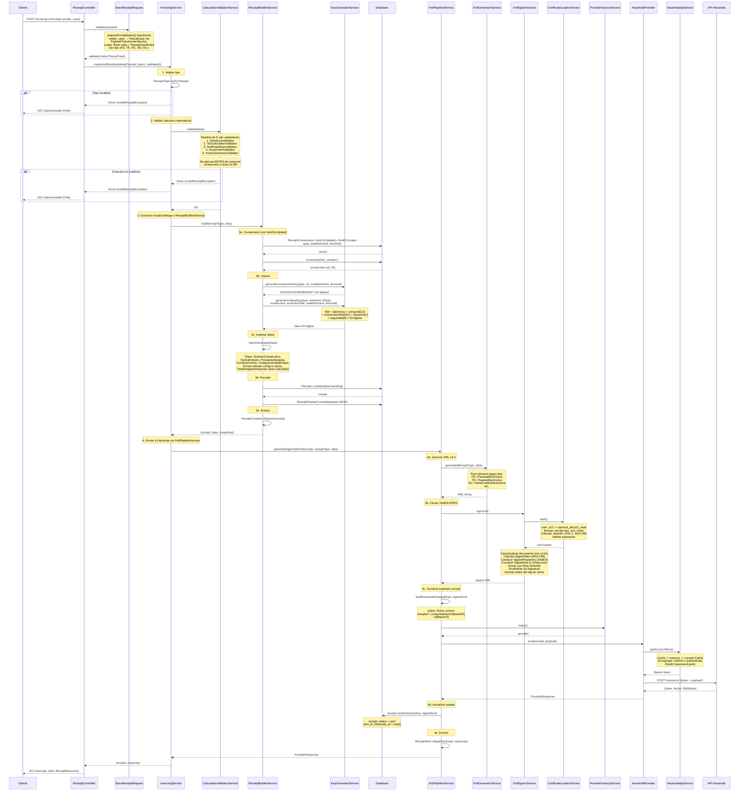
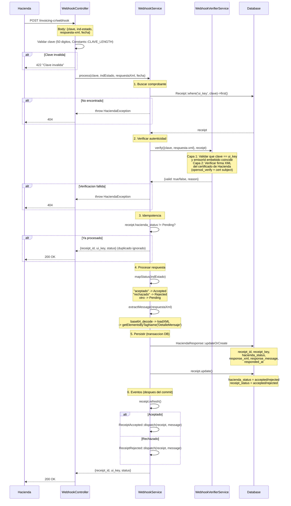
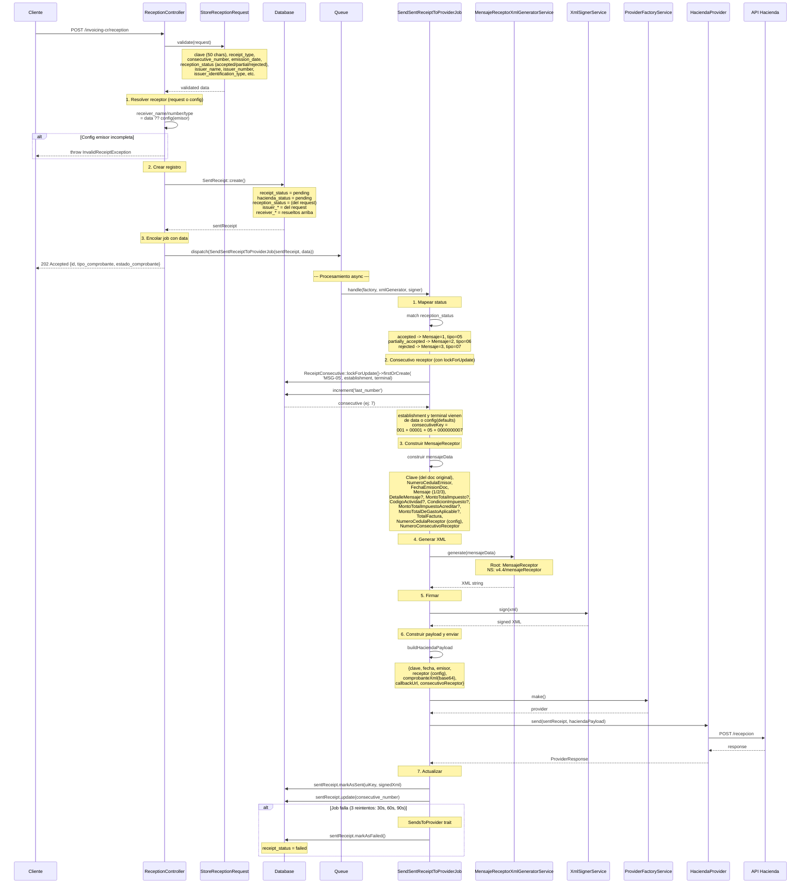
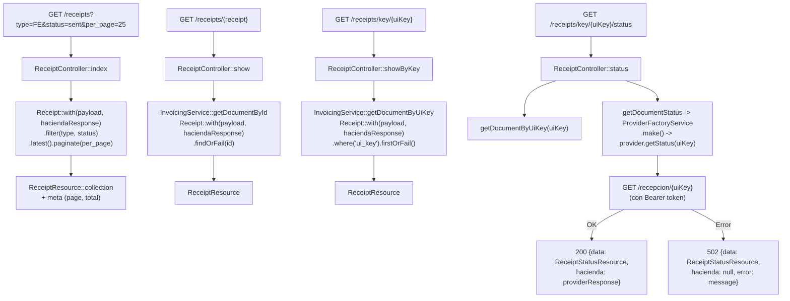
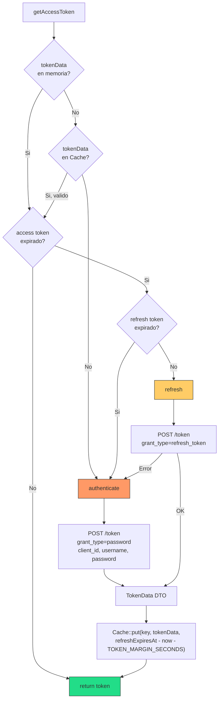
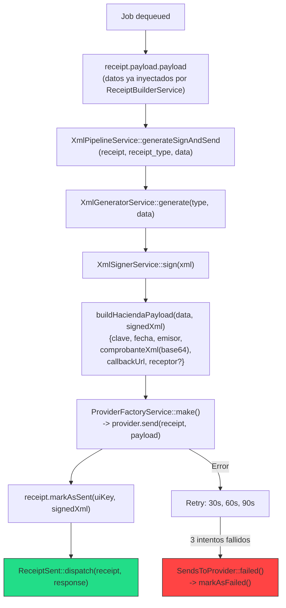
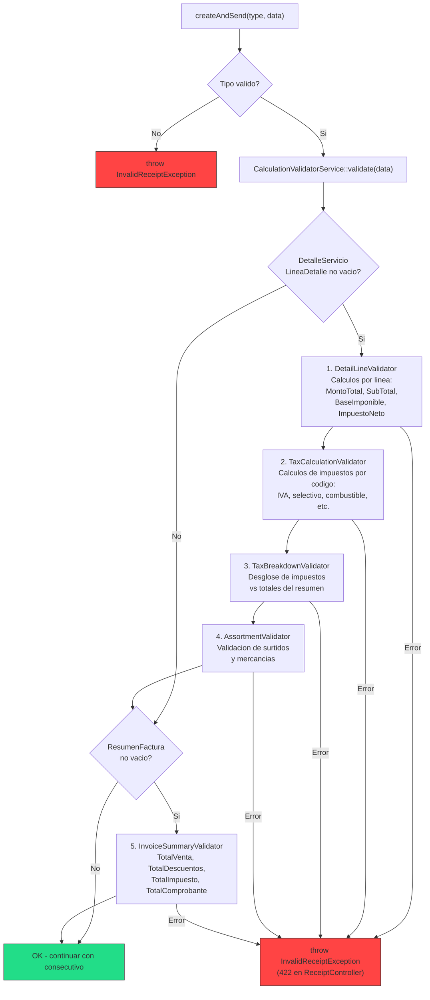
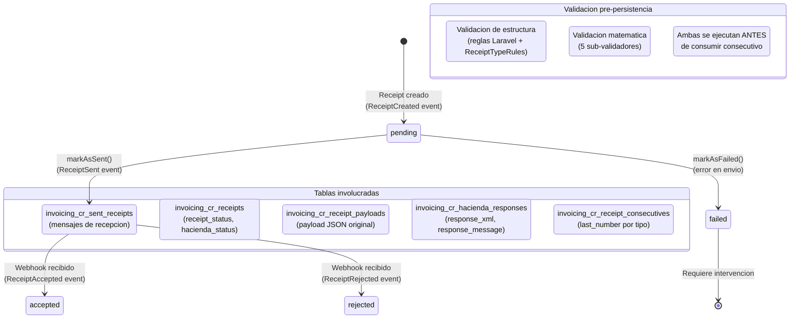

# Flujos End-to-End — laravel-paquete-facturacion

---

## Flujo 1: Crear y Enviar Comprobante

`POST /invoicing-cr/receipts`

> **Arquitectura:** `InvoicingService` es un orquestador delgado que delega a `ReceiptBuilderService` (consecutivo, clave, persistencia, evento `ReceiptCreated`) y `XmlPipelineService` (XML, firma, envio, evento `ReceiptSent`). En modo async, despacha `SendReceiptToProviderJob` en vez de llamar al pipeline.

> **Nota:** El `ReceiptController::store` captura `InvalidReceiptException` (lanzada tanto por tipo invalido como por validaciones de calculo) y retorna `422 Unprocessable Entity` con los detalles del error.

> **Modo async:** Si `config('invoicing-cr.invoicing.send_mode')` es `async`, el paso 4 (XmlPipelineService) no se ejecuta en el request. En su lugar, se despacha `SendReceiptToProviderJob` y el controller retorna `202 Accepted` inmediato con el receipt en estado `pending`. El Job ejecuta el paso 4 en background con 3 reintentos (30s, 60s, 90s). Ideal para POS/ERP donde no se puede bloquear el request.

---

## Flujo 2: Webhook de Hacienda (respuesta async)

`POST /invoicing-cr/webhook`

---

## Flujo 3: Recepcion de Documento (MensajeReceptor)

`POST /invoicing-cr/reception` -> Job async

---

## Flujo 4: Consultas (GET)

---

## Flujo 5: Autenticacion OAuth2 (IdP)

**Cache key**: `invoicing_cr_idp_token_{ambiente}_{md5(username)}`

---

## Flujo 6: Firma XAdES-EPES

```mermaid
flowchart TD
    A[sign XML string] --> B[CertificateLoader::load]
    B --> B1["Leer .p12 -> openssl_pkcs12_read<br/>Extraer: privateKey, cert, chain<br/>Calcular: base64, SHA-1, SHA-256<br/>Validar expiracion"]

    B1 --> C["Cargar XML en DOMDocument"]
    C --> D["Generar IDs unicos:<br/>signatureId, xadesId,<br/>referenceId, valueId"]

    D --> E["Canonicalizar documento<br/>(exc-c14n, excluir ds:Signature)"]
    E --> F["DigestValue = SHA-256(canonical)"]

    F --> G["Construir SignedProperties"]
    G --> G1["SigningTime<br/>SigningCertificate (SHA-1 digest)<br/>IssuerSerial (DN + serial)<br/>SignaturePolicyIdentifier<br/>(URL + SHA-256 del PDF)<br/>DataObjectFormat"]

    G1 --> H["Canonicalizar SignedProperties<br/>DigestValue = SHA-256"]

    H --> I["Construir SignedInfo"]
    I --> I1["Reference 1: documento<br/>(XPath not ancestor ds:Signature)<br/>Reference 2: SignedProperties<br/>(URI=#xadesId)"]

    I1 --> J["Canonicalizar SignedInfo"]
    J --> K["openssl_sign(canonical, RSA-SHA256)"]
    K --> L["SignatureValue = base64(firma)"]

    L --> M["Ensamblar ds:Signature"]
    M --> M1["SignedInfo + SignatureValue<br/>+ KeyInfo (X509Certificate)<br/>+ Object (QualifyingProperties)"]

    M1 --> N["Insertar antes del<br/>tag de cierre del root"]
    N --> O[XML firmado]

    style O fill:#2d8,stroke:#333
```

---

## Flujo 7: Job Async — SendReceiptToProviderJob

> Activo cuando `INVOICING_CR_SEND_MODE=async`. El controller retorna 202 inmediato y el Job ejecuta XML, firma, envio en background con 3 reintentos (30s, 60s, 90s). Implementa `ShouldBeUnique` (uniqueId: `receipt-{id}`).

---

## Flujo 8: Pipeline de Validacion de Calculos

El `CalculationValidatorService` se ejecuta como paso 2 del Flujo 1, **antes** de consumir consecutivo o persistir en base de datos. Esto garantiza que no se desperdician consecutivos en comprobantes con errores matematicos.

---

## Resumen de Tablas y Estado

